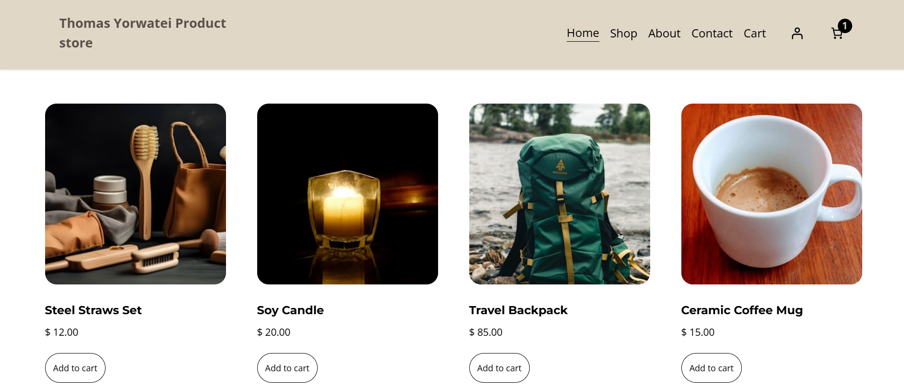
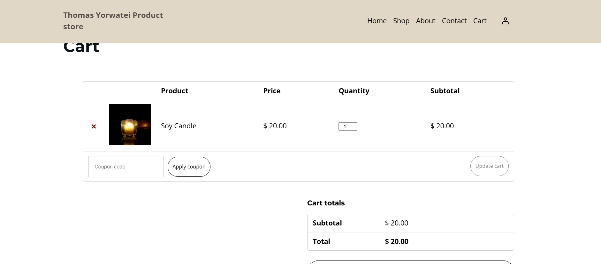

# E-Commerce Website - WordPress & WooCommerce

## Student Information

| Field | Details |
|-------|---------|
| Student Name | Thomas Yorwatei |
| Student ID | 22067/2023 |
| Course | Ecommerce |
| Semester | Year 3 |
| Instructor | Eric Maniraguha |

---

## Project Title

**E-Commerce Website Development using WordPress & WooCommerce**

---

## Platform Used

| Component | Technology |
|-----------|------------|
| Hosting | Hostinger (Subdomain) |
| CMS | WordPress 6.x |
| E-Commerce Plugin | WooCommerce |
| Theme | Astra (Free Version) |
| Language | PHP, HTML, CSS, JavaScript |
| Database | MySQL |
| Version Control | Git & GitHub |

---

## Features Implemented

### Homepage
- Store name displayed prominently
- Welcome message and brand introduction
- Featured products section with categories
- Navigation menu with all pages
- Hero/banner section with "Shop Now" CTA

### Product Page
- 5+ Products with detailed information:
  - Steel Straws Set - $12.00
  - Soy Candle - $20.00
  - Travel Backpack - $85.00
  - Ceramic Coffee Mug - $15.00
- Product images for each item
- Price display
- Product descriptions
- Add to cart buttons
- Product categories (Home Decor, Fresh Foods, Tech Gear, Accessories)

### About Page
- Store description
- Mission statement
- Store history
- Why choose us section
- Core values

### Contact Page
- Contact form (using Contact Form 7)
- Email address
- Phone number
- Physical address
- Business hours

### Cart Interaction
- Add to cart functionality
- View cart page
- Update quantities
- Remove items
- Cart total calculation
- Proceed to checkout

### Additional Features
- Responsive design (mobile-friendly)
- User-friendly navigation
- Professional appearance with Astra Theme
- WordPress backend management
- WooCommerce integration
- Newsletter subscription section

---

## Screenshots

### Homepage

*E-commerce homepage with welcome message and featured products*

### Product Page

*Product listing page showing 5+ products with images, prices, and descriptions*

### Cart Page

*Shopping cart with add-to-cart interaction and total calculation*

---

## Repository Structure
ecommerce-website-wordpress/
│
├── README.md # Project documentation
├── images/ # Screenshots folder
│ ├── homepage.png
│ ├── product-page.png
│ ├── about-page.png
│ ├── contact-page.png
│ └── cart-page.png
│
└── (WordPress deployment files on Hostinger)

---

## Live Website Link

**Live Website:** [https://vgmissionary.org/](https://vgmissionary.org/)

This project is hosted on Hostinger and is fully functional with all e-commerce features.

---

## GitHub Repository

**Repository Link:** [https://github.com/thomasyorwatei/ecommerce-website-wordpress](https://github.com/thomasyorwatei/ecommerce-website-wordpress)

---

## Deployment Process

The website was deployed using Hostinger's one-click WordPress installer on a subdomain. The steps included:

1. Creating a subdomain in Hostinger hPanel
2. Using Hostinger's Auto Installer to install WordPress
3. Installing and activating Astra theme
4. Installing WooCommerce and Contact Form 7 plugins
5. Creating products, pages, and customizing the site
6. Configuring the navigation menu and homepage settings

---

## Challenges Faced and Solutions

### Challenge 1: Theme Selection
**Issue:** Finding a completely free e-commerce theme on WordPress.com
**Solution:** Switched to self-hosted WordPress on Hostinger subdomain and used Astra free theme

### Challenge 2: Subdomain Dashboard Redirection
**Issue:** Admin panel button redirected to main domain
**Solution:** Used direct URL https://vgmissionary.org/wp-admin to access dashboard

### Challenge 3: WooCommerce Setup
**Issue:** Configuring products and categories
**Solution:** Created product categories (Home Decor, Fresh Foods, Tech Gear, Accessories) and added products with proper descriptions

### Challenge 4: WordPress.com Limitations
**Issue:** WooCommerce and plugins not available on free WordPress.com plan
**Solution:** Used Hostinger hosting with full WordPress installation

---

## Lessons Learned

### Technical Skills
1. WordPress Architecture - Understanding core files, themes, and plugins
2. Database Management - MySQL setup and configuration
3. Hosting - Deploying WordPress on Hostinger subdomain
4. E-Commerce Integration - WooCommerce plugin and its features
5. Version Control - Git and GitHub for project management
6. Documentation - Markdown for professional reporting

### Project Management
1. Planning and structuring project requirements
2. Problem-solving and debugging techniques
3. Attention to detail in implementation
4. Documentation and presentation skills

---

## Future Improvements

- Deploy to production with full domain
- Add payment gateway integration (Stripe/PayPal)
- Add user registration and login
- Add product reviews and ratings
- Implement product search functionality
- Add shopping cart persistence
- Enable order tracking system
- Add social media integration
- Implement newsletter subscription
- Enhance mobile responsiveness
- Optimize for SEO

---

## Contact

**Student Name:** Thomas Yorwatei  
**Student ID:** 22067/2023  
**Course:** Ecommerce  
**GitHub:** https://github.com/thomasyorwatei

---

## Acknowledgments

- Instructor: Eric Maniraguha for guidance
- WordPress Community for open-source software
- WooCommerce Team for e-commerce platform
- Astra Theme Team for free theme
- Hostinger for hosting services

---

## License

This project is licensed under the MIT License - see the LICENSE file for details.

---
